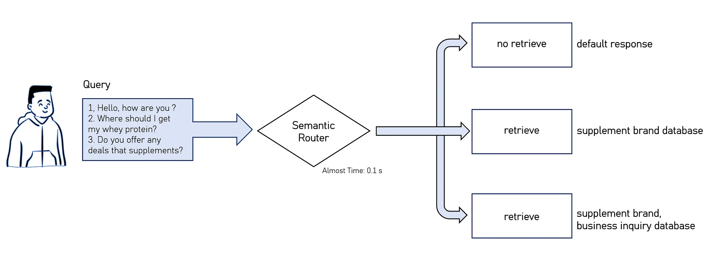

### [Tutorial on my Medium blog is available here.](https://medium.com/@thnhnguyn_58308/semantic-router-for-multiple-documents-77690224cb81)


## Introduction

[Semantic Router](https://github.com/aurelio-labs/semantic-router) is an open-source framework designed to serve as a high-speed decision-making layer for Language Models (LLMs) and intelligent agents. This innovative router uses the semantic meaning of queries and documents to make real-time routing decisions, significantly enhancing the efficiency and relevance of information retrieval.

This tutorial will leverage semantic vector space to determines which documents from a database should be retrieved in response to a given query, whether it’s multiple documents, a single document, or none at all.



## Install 

### 1. If you only want to implement multiple routes.
```
pip install semantic-router
```

### 2. If you run to generate questions.

Example is running with LlamaCpp Python and Instructor. You can running with other framework LLMs, [more info in here](https://github.com/jxnl/instructor).

```
pip install instructor
```


**[Install llama cpp python with CUDA.](https://llama-cpp-python.readthedocs.io/en/latest/)**

To install with CUDA support, set the `LLAMA_CUDA=on` environment variable before installing:

```
CMAKE_ARGS="-DLLAMA_CUDA=on" pip install llama-cpp-python
```

**[Download llama3-8b](https://huggingface.co/meta-llama/Meta-Llama-3-8B/tree/main)**

```
curl -L -o meta-llama-3-8b-instruct.Q8_0.gguf https://huggingface.co/SanctumAI/Meta-Llama-3-8B-Instruct-GGUF/resolve/main/meta-llama-3-8b-instruct.Q8_0.gguf
```
